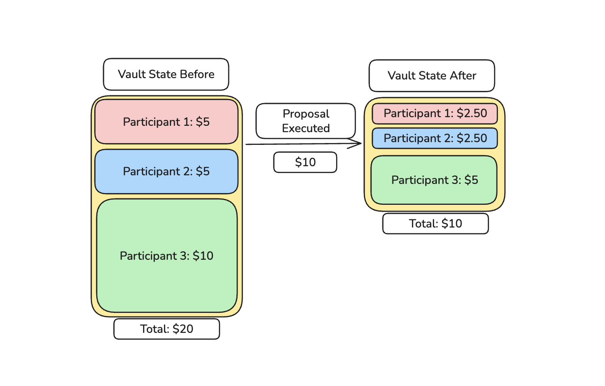

<h1 align="center"><strong> Fridge DAO</h1>

## Description
This repo contains the backend, soon-to-be onchain logic for the Fridge DAO, the revolutionary Decentralized Autonomous Organization that will decide what to order for the office fridge.

### Invarients
This DAO uses quadratic voting, where *n* tokens = $\sqrt{n}$ votes.
This can be illustrated as such:
| Participant | Vote Tokens | Vote Power |
| --- | --- | --- |
| 1 | 100 | 10 |
| 2 | 9 | 3 |
| 3 | 9 | 3 |
| 4 | 4 | 2 |
| 5 | 4 | 2 |
(Example taken from [NodeGuardians - Quadratic Goods](https://nodeguardians.io/adventure/quadratic-public-goods/))

This system discourages one user from dominating the voting process. Without quadratic voting, Participant 1 can vote for one proposal, and theres nothing any of the other participants can do to stop that proposal from getting passed.

In the case of this DAO, a vault design is implemented to hold user funds. When a user wants to join the DAO, they must make a deposit of funds into the vault.
Since this DAO votes on snacks to order for the office, their deposit is automatically taken from the vault and contributes to the cost of the order.

Since tokens are taken from the vault, it is necessary to keep track of how much each user has contributed. The invarient is defined as follows: Each members ratio between their contribution and the total vault amount remain consistent before and after the proposal is executed. This is shown below in a simplified manner:

Participant 1 and 2 both have $\frac{1}{4}$ of the total vault before the proposal is chosed, and Participant 3 has $\frac{1}{2}$ of the vault, with a total of $20 in the vault. The proposal was executed, and an item worth $10 was purchased. 10 is 50% of 20, therefore each Participant's balance must be reduced by 50%.

Participant's may choose to deposit more tokens into the vault at any time, except when the voting period ends.

## Requirements
[Rust/Cargo](https://doc.rust-lang.org/cargo/getting-started/installation.html) 
[Anchor/Solana](https://solana.com/docs/intro/installation) 
